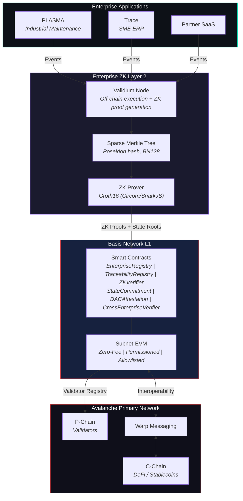
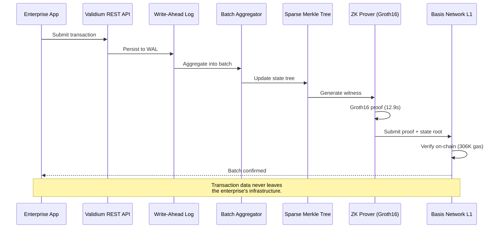
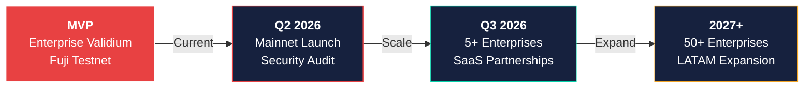

# Basis Network

[](https://github.com/sebastian-quintero-osorio/basis-network/actions/workflows/ci.yml)
[](./LICENSE)
[](https://soliditylang.org/)
[-E84142.svg?logo=data:image/svg+xml;base64,PHN2ZyB3aWR0aD0iMjU0IiBoZWlnaHQ9IjI1NCIgdmlld0JveD0iMCAwIDI1NCAyNTQiIGZpbGw9Im5vbmUiIHhtbG5zPSJodHRwOi8vd3d3LnczLm9yZy8yMDAwL3N2ZyI+PHJlY3Qgd2lkdGg9IjI1NCIgaGVpZ2h0PSIyNTQiIHJ4PSI0MiIgZmlsbD0id2hpdGUiLz48L3N2Zz4=)](https://www.avax.network/)
[](./.github/workflows/ci.yml)
[-8B5CF6.svg)](./validium/circuits/)
[](https://dashboard.basisnetwork.com.co)
[](https://explorer.basisnetwork.com.co)

**Enterprise-grade Avalanche L1 for Latin American industries.**

Basis Network is a sovereign, permissioned blockchain deployed as an Avalanche L1 (Subnet-EVM). It provides enterprises with zero-fee transactions, data privacy via zero-knowledge proofs, and native interoperability with the Avalanche ecosystem. Each enterprise operates its own ZK Layer 2 -- data stays private, only proofs are verified on-chain.

The native currency is **Lithos** (LITHOS), with the smallest denomination called **Tomo** (1 LITHOS = 10^18 Tomos). Both names derive from Greek: *lithos* (foundation stone) and *tomos* (an indivisible unit).

Built by [Base Computing S.A.S.](https://basecomputing.com.co) -- Submitted to [Avalanche Build Games 2026](https://www.avax.network/)

[Website](https://basisnetwork.com.co) |
[Dashboard](https://dashboard.basisnetwork.com.co) |
[Explorer](https://explorer.basisnetwork.com.co) |
[Documentation](./docs/)

---

## The Problem

Enterprise blockchain in Latin America is projected to grow from **$1.2B to $58B by 2034** -- yet no existing solution serves this market effectively. Enterprises in agribusiness, manufacturing, logistics, and financial services need immutable, auditable records of their operations. Current solutions fail:

- **Public blockchains** (Ethereum, Polygon): expensive per-transaction fees and expose proprietary data.
- **Private blockchains** (Hyperledger Fabric): isolated silos with zero interoperability and no ZK privacy.
- **No existing blockchain** was designed for the regulatory, economic, or operational reality of the region.

## The Solution

Basis Network is an independent Avalanche L1 where each enterprise operates its own ZK Layer 2:

- **Zero-fee transactions** -- no gas costs; sustainability via SaaS subscriptions.
- **Complete data privacy** -- sensitive data stays off-chain; only ZK proofs and hashes are stored on-chain.
- **Permissioned access** -- only KYC/KYB-verified enterprises can transact.
- **Trustless cross-enterprise verification** -- companies verify each other's compliance without revealing proprietary information.
- **Interoperable** -- native cross-chain communication via Avalanche Warp Messaging (AWM).
- **EVM-compatible** -- any Solidity developer can build integrations.

---

## Architecture



The system uses a four-layer architecture. Enterprise applications emit events to their dedicated Validium Node, which processes transactions off-chain, maintains state in a Sparse Merkle Tree, generates Groth16 ZK proofs, and submits them to the Basis Network L1 for on-chain verification. The L1 anchors to the Avalanche Primary Network for validator security and cross-chain interoperability.

For detailed architecture documentation, see [docs/ARCHITECTURE.md](./docs/ARCHITECTURE.md).

---

## Repository Structure

```
basis-network/
|-- l1/                         # Basis Network L1 (shared foundation)
|   |-- contracts/              # Smart contracts (Hardhat + Solidity 0.8.24)
|   |   |-- contracts/
|   |   |   |-- core/           # EnterpriseRegistry, TraceabilityRegistry, StateCommitment
|   |   |   +-- verification/   # ZKVerifier, DACAttestation, CrossEnterpriseVerifier
|   |   |-- test/               # 154 unit + integration tests (all passing)
|   |   +-- scripts/            # Deployment scripts
|   |-- config/                 # Avalanche L1 genesis and node configuration
|   +-- dashboard/              # Network dashboard (Next.js + Tailwind CSS)
|-- validium/                   # MVP: Enterprise ZK Validium Node (COMPLETE)
|   |-- node/                   # Enterprise validium node service (TypeScript)
|   |   +-- src/
|   |       |-- state/          # SparseMerkleTree (Poseidon, BN128)
|   |       |-- queue/          # TransactionQueue + WAL
|   |       |-- batch/          # BatchAggregator + BatchBuilder
|   |       |-- da/             # DACProtocol + Shamir SSS
|   |       |-- prover/         # ZK Prover (snarkjs Groth16)
|   |       |-- submitter/      # L1 Submitter (ethers.js v6)
|   |       |-- api/            # Fastify REST API
|   |       |-- cross-enterprise/ # Cross-reference builder
|   |       +-- orchestrator.ts # Main state machine
|   |-- circuits/               # ZK circuits (Circom + SnarkJS)
|   |-- adapters/               # Blockchain Adapter Layer (Node.js + ethers.js v6)
|   |-- research/               # R&D experiments and foundational specs
|   |-- specs/                  # TLA+ formal specifications (model-checked)
|   |-- proofs/                 # Coq verification proofs
|   |-- tests/                  # Adversarial test reports
|   +-- docs/                   # Roadmap, checklist, pipeline report
|-- zkl2/                       # V2: Enterprise zkEVM L2 (Go + Rust)
|   |-- contracts/              # L2 smart contracts (386 tests)
|   |-- docs/                   # Architecture and technical decisions
|   |-- research/               # R&D experiments
|   |-- specs/                  # TLA+ formal specifications
|   +-- proofs/                 # Coq verification proofs
|-- lab/                        # AI-driven R&D pipeline (4-agent system)
|   |-- orchestrator/           # Execution protocol and prompts
|   |-- 1-scientist/            # Research agent
|   |-- 2-logicist/             # TLA+ specification agent
|   |-- 3-architect/            # Implementation agent
|   +-- 4-prover/               # Coq verification agent
+-- docs/                       # Technical documentation
```

---

## Tech Stack

| Component | Technology |
|---|---|
| L1 Framework | Subnet-EVM (Avalanche) |
| Consensus | Snowman (sub-second finality) |
| Smart Contracts | Solidity 0.8.24 (EVM target: Cancun) |
| Contract Framework | Hardhat + TypeScript |
| Blockchain Interaction | ethers.js v6 |
| ZK Proofs | Circom 2.2.x + SnarkJS 0.7.x (Groth16) |
| Enterprise Node | TypeScript + Fastify |
| State Management | Sparse Merkle Tree (Poseidon, BN128) |
| Dashboard | Next.js + Tailwind CSS |
| Hosting | Vercel |
| Formal Specification | TLA+ (model-checked with TLC) |
| Formal Verification | Coq/Rocq |
| Network | Avalanche Fuji Testnet |
| Native Currency | Lithos (LITHOS) -- smallest unit: Tomo |

---

## Deployed Contracts (Fuji Testnet)

Live on Basis Network L1 (Avalanche Subnet-EVM, Chain ID `43199`):

- **Subnet ID:** `AYdFRP6MsbHq51MnUqmg5o4Eb92jPTgyPvq92dDQULVo9pwAk`
- **Blockchain ID:** `2VtYqDeZ5RabHM8zA4x94T6DMdzs3svkfcpF7TLEmTpETUTufR`
- **RPC:** `https://rpc.basisnetwork.com.co`
- **Dashboard:** [dashboard.basisnetwork.com.co](https://dashboard.basisnetwork.com.co)
- **Explorer:** [explorer.basisnetwork.com.co](https://explorer.basisnetwork.com.co)

| Contract | Address | Purpose |
|---|---|---|
| EnterpriseRegistry | `0xB030b8c0aE2A9b5EE4B09861E088572832cd7EA5` | Enterprise onboarding and permissions |
| TraceabilityRegistry | `0x0a84C68Fe45d3036Fe66ad219f37963c79140fcb` | Generic event recording |
| ZKVerifier | `0x51B072d47f40ab7aaeD2D7744a17Bf5b53fC916D` | Groth16 proof verification |
| Groth16Verifier | `0xEe0149b9E547cfD7e31274EE3DA25DCEd48703a6` | snarkjs-generated verifier (VK baked in) |
| StateCommitment | `0x0FD3874008ed7C1184798Dd555B3D9695771fb5b` | Per-enterprise state root tracking |
| DACAttestation | `0xBa485D9b8b8b132E5eC4d7Bcf5F0B18aD10fCB22` | Data Availability Committee attestation |
| CrossEnterpriseVerifier | `0x188125658E9Bd8D7a026A52052dB9B970d6441A9` | Inter-enterprise cross-reference verification |

**On-chain activity:** 2 enterprises registered, first ZK batch verified on-chain (8 transactions, Groth16, 306K gas).

---

## Quick Start

### Prerequisites

- Node.js >= 18
- npm >= 9
- Avalanche CLI ([installation guide](https://build.avax.network/docs/tooling/avalanche-cli))

### Smart Contracts

```bash
cd l1/contracts
npm install
npx hardhat compile    # Compiles 7 contracts (EVM target: cancun)
npx hardhat test       # Runs 154 tests (all passing)
```

### Validium Node

```bash
cd validium/node
npm install
npm test               # Runs 316 tests (all passing)
```

### ZK Circuits

```bash
cd validium/circuits
npm install
npm run setup    # One-time trusted setup (Powers of Tau + Groth16 keys)
npm run prove    # Generate a proof for a sample batch
npm run verify   # Verify the proof locally
```

### Dashboard

```bash
cd l1/dashboard
npm install
npm run dev      # Starts on http://localhost:3000
```

### Adapter Demo

```bash
cd validium/adapters
npm install
npm run demo     # Simulates PLASMA + Trace events writing on-chain
```

---

## Smart Contracts

Seven contracts form the on-chain protocol (L1 as generic settlement layer):

| Contract | Purpose | Tests |
|---|---|---|
| `EnterpriseRegistry.sol` | Enterprise onboarding, permissions, and metadata management | 13 |
| `TraceabilityRegistry.sol` | Generic, application-agnostic event recording | 16 |
| `ZKVerifier.sol` | Groth16 zero-knowledge proof verification | 11 |
| `Groth16Verifier.sol` | snarkjs-generated verifier with VK baked as constants | (via StateCommitment) |
| `StateCommitment.sol` | Per-enterprise state root tracking with delegated ZK verification | 38 |
| `DACAttestation.sol` | Data Availability Committee attestation and certification | 22 |
| `CrossEnterpriseVerifier.sol` | Inter-enterprise cross-reference verification | 18 |

All contracts use custom errors for gas-efficient reverts, NatSpec documentation for every public function, and role-based access control tied to `EnterpriseRegistry`.

---

## ZK Validium Pipeline

The ZK validium pipeline is **fully operational and verified on-chain**. Enterprise transactions flow from application to L1 verification without exposing private data:



### Pipeline Specifications

| Metric | Value |
|---|---|
| Circuit | `state_transition.circom` (depth=32, batch=8) |
| Constraints | 274,291 |
| Proof system | Groth16 (BN128) |
| Trusted setup | Powers of Tau 2^19 (524K max constraints) |
| Proof generation | 12.9 seconds |
| On-chain verification | 306K gas via Groth16Verifier |
| State tree | Sparse Merkle Tree (Poseidon hash, BN128 curve) |
| Data availability | DAC with Shamir Secret Sharing |

### Validium Node Modules

| Module | Description | Tests |
|---|---|---|
| Sparse Merkle Tree | Poseidon-based state management (BN128) | 52 |
| Transaction Queue + WAL | Durable transaction ordering with write-ahead log | 66 |
| Batch Aggregator | Configurable batching with threshold triggers | 45 |
| DAC Protocol + Shamir SSS | Data availability with secret sharing | 67 |
| ZK Prover | Groth16 proof generation via snarkjs | -- |
| L1 Submitter | On-chain submission via ethers.js v6 | -- |
| REST API | Fastify-based enterprise API | -- |
| Orchestrator | State machine coordinating all modules | 19 |
| Cross-Enterprise | Cross-reference builder for inter-enterprise proofs | 19 |

**R&D artifacts:** All modules are backed by [TLA+ formal specifications](./validium/specs/), [Coq verification proofs](./validium/proofs/), and [adversarial test reports](./validium/tests/).

---

## AI-Driven R&D Pipeline

Development is accelerated by an automated research pipeline of 4 specialized agents:

| Agent | Role | Output |
|---|---|---|
| Scientist | Literature review, experiments, benchmarks | `research/experiments/` |
| Logicist | TLA+ formal specifications, model checking | `specs/units/` |
| Architect | Production implementation, adversarial testing | `node/`, `circuits/`, `tests/` |
| Prover | Coq formal verification proofs | `proofs/units/` |

The pipeline produced the entire validium node (28/28 research units completed) and is currently building the zkEVM L2 architecture. It delivers development velocity that typically requires teams 10x the size.

---

## Real-World Traction

Basis Network is not a competition project. It is built by a two-year-old deep tech company with production software and enterprise clients:

- **[PLASMA](https://basecomputing.com.co)** is deployed at Ingenio Sancarlos (one of Colombia's largest sugar mills), delivering 75-91% operational efficiency gains and 300M COP in documented savings.
- **[Trace](https://traceerp.com)** is a live ERP serving SME clients at ~3M COP/year per client.
- **Base Computing S.A.S.** generates 50M+ COP in revenue before its first year of operation.
- **First ZK batch verified on-chain** -- 8 transactions, Groth16 proof, 306K gas, confirmed on Basis Network L1.
- **SaaS partnerships in progress** -- allied with DSI (health sector SaaS) and Fanelian (custom software), with advanced negotiations in Colombia's gaming sector.
- **Zero cold outreach needed** -- first mainnet users will be existing PLASMA and Trace clients, migrating with real transaction volume from day one.

---

## Roadmap



| Phase | Timeline | Milestone |
|---|---|---|
| MVP (current) | Build Games 2026 | L1 on Fuji, 7 contracts, ZK validium pipeline verified E2E, 604+ tests |
| Mainnet | Q2 2026 | Security audit, Avalanche Mainnet launch, C-Chain bridge, Delaware LLC, Codebase accelerator |
| Scale | Q3 2026 | 5+ enterprises on mainnet, SaaS Partnership Program, seed round ($500K-1M) |
| Expand | Q4 2026 - 2027 | 50+ enterprises via SaaS partnerships across 3+ LATAM countries, PLONK migration |

---

## Revenue Model

Three revenue engines -- the first already proven:

1. **SaaS with embedded blockchain** -- PLASMA and Trace generate revenue today from enterprise clients. Blockchain adds immutability and auditability as a premium layer.
2. **SaaS Partnership Program** -- Software companies integrate with Basis Network once and onboard their entire client base. Monthly per-enterprise fee. One partnership = dozens of enterprises without direct sales.
3. **Cross-enterprise verification fees** -- Enterprises pay to verify suppliers and partners via ZK proofs without revealing data. Network effects create switching costs and a defensible moat.

**Long-term:** LITHOS (native token) captures protocol value through gas, validator staking, governance, and verification fees -- backed by real enterprise activity. Infrastructure costs are minimal (~$15K/year for validators).

---

## Testing

604+ automated tests across the codebase:

| Component | Tests | Status |
|---|---|---|
| L1 Smart Contracts | 154 | Passing |
| Validium Node | 316 | Passing |
| ZK Circuits | 54 | Passing |
| zkEVM L2 Contracts | 386 | In development |

Tests include unit tests, integration tests, adversarial scenarios, and model-checked TLA+ specifications.

---

## Documentation

| Document | Description |
|---|---|
| [Architecture](./docs/ARCHITECTURE.md) | System design with Mermaid diagrams |
| [Technical Decisions](./docs/TECHNICAL_DECISIONS.md) | Justified design choices (ADR format) |
| [L2 MVP Vision](./docs/L2_MVP_VISION.md) | Enterprise ZK Validium Node design and motivation |
| [MoSCoW](./docs/MOSCOW.md) | Feature prioritization framework |
| [User Journey](./docs/USER_JOURNEY.md) | End-to-end user flows |
| [Deployment Guide](./docs/DEPLOYMENT_GUIDE.md) | Step-by-step setup instructions |
| [Validium Roadmap](./validium/docs/PRODUCTION_ROADMAP.md) | Production status (~96% complete) |
| [zkL2 Roadmap](./zkl2/docs/PRODUCTION_ROADMAP.md) | Production status (~95% complete) |

---

## Ecosystem

| Property | URL |
|---|---|
| Website | [basisnetwork.com.co](https://basisnetwork.com.co) |
| Dashboard | [dashboard.basisnetwork.com.co](https://dashboard.basisnetwork.com.co) |
| Explorer | [explorer.basisnetwork.com.co](https://explorer.basisnetwork.com.co) |
| RPC Endpoint | `https://rpc.basisnetwork.com.co` |
| Base Computing | [basecomputing.com.co](https://basecomputing.com.co) |
| Trace ERP | [traceerp.com](https://traceerp.com) |

### Community

| Platform | Link |
|---|---|
| Twitter / X | [@basis_network_](https://x.com/basis_network_) |
| Instagram | [@basis_network](https://www.instagram.com/basis_network/) |
| Telegram | [t.me/basisnetwork](https://t.me/basisnetwork) |
| Discord | [Join](https://discord.gg/zDrSRGrv) |
| GitHub | [sebastian-quintero-osorio/basis-network](https://github.com/sebastian-quintero-osorio/basis-network) |

---

## Team

**Base Computing S.A.S.** -- Colombian deep tech startup, founded September 2024.

The founder is a serial entrepreneur in crypto since 2017 who left a CTO position to build Base Computing full-time. Basis Network began as his [university thesis project](https://demos.basecomputing.com.co/) at Pontificia Universidad Javeriana (Cali, 2023) -- a blockchain-based voting system that required its own blockchain infrastructure. The first prototype was built in Python. During that research, he identified fundamental gaps in enterprise blockchain: no privacy, no interoperability, no affordability for Latin American markets. Base Computing was founded to solve these problems.

Today, the company operates two revenue-generating SaaS products (PLASMA and Trace), serves enterprise clients in production, and is building Basis Network as the enterprise blockchain infrastructure layer for LATAM on Avalanche.

- Winner of **Gen N 2025 "Next" category** (Ruta N Medellin -- LATAM's leading innovation hub)
- **"Joven Referente 2026"** and **Innovation Ambassador** (District of Medellin)
- Ruta N Innovation Ambassador 2026 with year-round access to enterprise ecosystem and regional media
- Top 50 / 1,300+ in Nestle Young Creators Challenge 2025
- Accepted into **Avalanche Build Games 2026** ($1M prize pool)
- **Next:** Delaware LLC incorporation, [Codebase](https://codebase.avax.network/) accelerator application, seed round

### In the Press

- [El Colombiano](https://www.elcolombiano.com/tecnologia/jovenes-de-medellin-convirtieron-su-curiosidad-en-tecnologia-de-servicio-estos-son-los-ganadores-de-proyector-gen-n-AC31996420) -- "Sebastian Tobar, con Base Computing, un emprendimiento de tecnologia blockchain."
- [El Tiempo](https://www.eltiempo.com/colombia/medellin/con-talleres-algoritmos-y-drones-que-miden-el-aire-los-jovenes-de-gen-n-no-solo-imaginan-la-medellin-del-futuro-la-estan-construyendo-ya-3519036) -- Gen N 2025 ceremony coverage, national reach.
- [Alcaldia de Medellin](https://www.medellin.gov.co/es/sala-de-prensa/noticias/medellin-aplaude-a-su-relevo-innovador-los-cinco-jovenes-ganadores-de-gen-n-proyector-2025) -- Official government recognition.
- [360 Radio](https://360radio.com.co/medellin/que-es-proyector-gen-n-iniciativa-que-conecta-a-jovenes-con-cti/) -- "Sebastian Tobar con Base Computing en Gen Next."
- [DPL News](https://dplnews.com/colombia-jovenes-de-medellin-convirtieron-su-curiosidad-en-tecnologia-de-servicio-estos-son-los-ganadores-de-proyector-gen-n/) -- LATAM technology media coverage.

Contact: [sebastian@basisnetwork.co](mailto:sebastian@basisnetwork.co)

---

## License

Business Source License 1.1 -- See [LICENSE](./LICENSE) for details.

Copyright (c) 2026 Base Computing S.A.S. All rights reserved.
