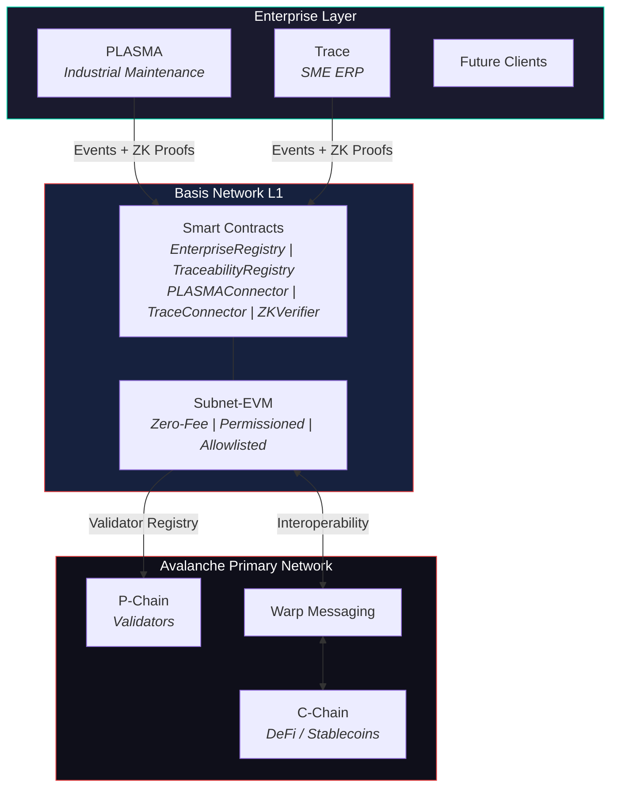
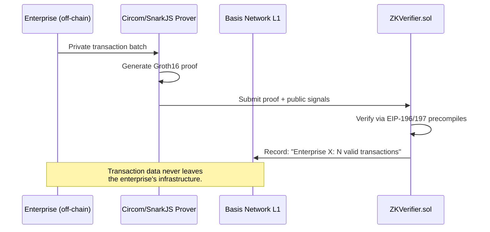
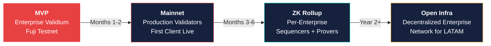

# Basis Network

[](https://github.com/sebastian-quintero-osorio/basis-network/actions/workflows/ci.yml)

**Enterprise-grade Avalanche L1 for Latin American industries.**

Basis Network is a sovereign, permissioned blockchain deployed as an Avalanche L1 (Subnet-EVM). It provides companies with zero-fee transactions, data privacy via ZK proofs, and native interoperability with the Avalanche ecosystem.

Built by [Base Computing S.A.S.](https://basecomputing.com.co) -- a Colombian deep tech startup with products in production serving real enterprise clients.

---

## The Problem

Latin American enterprises in agribusiness, manufacturing, and logistics need immutable, auditable records of their operations. Current solutions fail:

- **Public blockchains** (Ethereum, Polygon): expensive per-transaction fees and expose proprietary data.
- **Private blockchains** (Hyperledger): isolated silos with no interoperability.
- **No existing blockchain** was designed for the regulatory, economic, or operational reality of the region.

## The Solution

Basis Network is an independent Avalanche L1 that gives enterprises their own blockchain infrastructure:

- **Zero-fee transactions** -- no gas costs; sustainability via SaaS subscriptions.
- **Permissioned access** -- only KYC/KYB-verified enterprises can transact.
- **Privacy by design** -- sensitive data stays off-chain; only ZK proofs and hashes are stored on-chain.
- **Interoperable** -- native cross-chain communication via Avalanche Warp Messaging (AWM).
- **EVM-compatible** -- any Solidity developer can build integrations.

---

## Architecture



The adapter layer uses a **dual-write pattern**: existing applications continue writing to their databases without disruption, while simultaneously writing critical events on-chain as an immutable audit trail.

For detailed architecture documentation, see [docs/ARCHITECTURE.md](./docs/ARCHITECTURE.md).

---

## Repository Structure

```
basis-network/
├── contracts/              # Smart contracts (Hardhat + Solidity 0.8.24)
│   ├── contracts/
│   │   ├── core/           # EnterpriseRegistry, TraceabilityRegistry
│   │   ├── connectors/     # PLASMAConnector, TraceConnector
│   │   └── verification/   # ZKVerifier (Groth16)
│   ├── test/               # 72 unit tests (all passing)
│   └── scripts/            # Deployment scripts
├── l1-config/              # Avalanche L1 genesis and node configuration
├── adapter/                # Blockchain Adapter Layer (Node.js + ethers.js v6)
│   └── src/
│       ├── plasma-adapter/ # PLASMA -> on-chain bridge
│       ├── trace-adapter/  # Trace -> on-chain bridge
│       └── common/         # Transaction queue with retry logic
├── prover/                 # ZK proof generation (Circom + SnarkJS)
│   ├── circuits/           # Circom circuits (BatchVerifier)
│   └── scripts/            # Trusted setup, proof generation, verification
├── dashboard/              # Network explorer (Next.js + Tailwind CSS)
└── docs/                   # Technical documentation
    ├── ARCHITECTURE.md     # System architecture with diagrams
    ├── TECHNICAL_DECISIONS.md  # Justified design choices
    ├── MOSCOW.md           # Feature prioritization
    ├── USER_JOURNEY.md     # End-to-end user flows
    └── DEPLOYMENT_GUIDE.md # Step-by-step deployment instructions
```

---

## Tech Stack

| Component | Technology |
|---|---|
| L1 Framework | Subnet-EVM (Avalanche) |
| Consensus | Snowman (sub-second finality) |
| Smart Contracts | Solidity 0.8.24 (EVM target: Cancun) |
| Contract Framework | Hardhat + TypeScript |
| Blockchain Interaction | ethers.js v6 |
| ZK Proofs | Circom + SnarkJS (Groth16) |
| Dashboard | Next.js + Tailwind CSS |
| Hosting | Vercel |
| Network | Avalanche Fuji Testnet |

---

## Deployed Contracts (Fuji Testnet)

Live on Basis Network L1 (Avalanche Subnet-EVM, Chain ID `43199`):

- **Subnet ID:** `csFDHeZGWt36nqx3UuLeG6cs6daNUVrFEVGQ2tgoQfKPqPskx`
- **Blockchain ID:** `qTRKhytrdbPMCNSVf6Sr5kRxRCyqwLKQCibDzAYLqhKKUvPJX`
- **RPC:** `http://127.0.0.1:9650/ext/bc/qTRKhytrdbPMCNSVf6Sr5kRxRCyqwLKQCibDzAYLqhKKUvPJX/rpc`

| Contract | Address | Purpose |
|---|---|---|
| EnterpriseRegistry | `0xe10CCf26c7Cb6CB81b47C8Da72E427628c8a5E09` | Enterprise onboarding and permissions |
| TraceabilityRegistry | `0xAC00F4920665b1eA43F4F7Da7ef3714DE7acf6Fc` | Immutable event recording |
| PLASMAConnector | `0xF486547C8bF764eA4E53a05D745543f8a6973133` | Industrial maintenance bridge |
| TraceConnector | `0x3ABC06a56b7F7Ec3711C8282B5B778CE8e34Dda0` | ERP commercial bridge |
| ZKVerifier | `0x6e28B9DD35C752DF4a38040df31c9A82c5285aF2` | Groth16 proof verification |

**On-chain activity:** 3 registered enterprises, 10+ demo transactions (PLASMA work orders, Trace sales, inventory, supplier), 1 verified ZK batch proof (4 transactions, 530K gas).

---

## Quick Start

### Prerequisites

- Node.js >= 18
- npm >= 9
- Avalanche CLI ([installation guide](https://build.avax.network/docs/tooling/avalanche-cli))

### Smart Contracts

```bash
cd contracts
npm install
npx hardhat compile    # Compiles 5 contracts (EVM target: cancun)
npx hardhat test       # Runs 72 tests (all passing)
```

### ZK Prover

```bash
cd prover
npm install
npm run setup    # One-time trusted setup (Powers of Tau + Groth16 keys)
npm run prove    # Generate a proof for a sample batch
npm run verify   # Verify the proof locally
```

### Dashboard

```bash
cd dashboard
npm install
npm run dev      # Starts on http://localhost:3000
```

### Adapter Demo

```bash
cd adapter
npm install
npm run demo     # Simulates PLASMA + Trace events writing on-chain
```

---

## Smart Contracts

Five contracts form the on-chain protocol:

| Contract | Purpose | Tests |
|---|---|---|
| `EnterpriseRegistry.sol` | Enterprise onboarding, permissions, and metadata management | 24 |
| `TraceabilityRegistry.sol` | Immutable, timestamped operational event recording | 12 |
| `PLASMAConnector.sol` | Bridge for PLASMA industrial maintenance data | 15 |
| `TraceConnector.sol` | Bridge for Trace ERP commercial data | 12 |
| `ZKVerifier.sol` | Groth16 zero-knowledge proof verification | 9 |

All contracts use custom errors for gas-efficient reverts, NatSpec documentation for every public function, and role-based access control tied to `EnterpriseRegistry`.

---

## ZK Validium Architecture

Basis Network implements a **ZK validium** model for enterprise privacy:



1. Enterprises process transactions off-chain in their own infrastructure.
2. A prover generates Groth16 proofs attesting to batch validity without revealing content.
3. The proof is submitted to `ZKVerifier.sol`, which verifies it on-chain (~200K gas).
4. The L1 records that the batch is valid without knowing what it contains.

**Why Groth16 via Circom/SnarkJS:**
- Most gas-efficient verification on EVM (~200K gas per proof).
- Most mature circuit language and proving toolchain in the ZK ecosystem.
- Complete JavaScript pipeline (compile, setup, prove, verify, export Solidity verifier).
- EVM-native: exported verifier deploys directly to Subnet-EVM.
- Production-proven in Polygon zkEVM, Iden3, and Semaphore.
- Upgradeable: swapping the off-chain prover requires no on-chain changes.

The production roadmap includes evolution to full ZK rollups with per-enterprise sequencers and provers, developed through Base Computing's AI-automated R&D pipeline.

---

## Real-World Traction

Basis Network is not a hackathon-only project. It is built on top of real products with real clients:

- **PLASMA** is deployed at Ingenio Sancarlos (one of Colombia's largest sugar mills), delivering 75-91% operational efficiency gains and 300M COP in documented savings.
- **Trace** is a live ERP serving SME clients at ~3M COP/year per client.
- **Base Computing** generates 50M+ COP in revenue before its first year.

---

## Roadmap



| Phase | Timeline | Milestone |
|---|---|---|
| MVP (current) | Build Games 2026 | L1 on Fuji, smart contracts, ZK verifier PoC, dashboard |
| Mainnet | Months 1-2 post-competition | Migrate to Avalanche Mainnet, production validators |
| First Client | Months 3-4 | Ingenio Sancarlos (PLASMA) writing to mainnet |
| ZK Rollup | Months 6-12 | Per-enterprise sequencers and provers via R&D pipeline |
| Regional Expansion | Year 2+ | Open, decentralized enterprise infrastructure for LATAM |

---

## Business Model

The blockchain is infrastructure, not the product. Revenue streams:

1. **SaaS subscriptions** -- PLASMA and Trace (already generating revenue)
2. **Enterprise onboarding** -- setup fee + monthly infrastructure subscription
3. **Node hosting** -- managed validator nodes for enterprises
4. **BaaS** -- API access for third-party developers
5. **Consulting** -- custom smart contract development and integration

---

## Documentation

| Document | Description |
|---|---|
| [Architecture](./docs/ARCHITECTURE.md) | System design with Mermaid diagrams |
| [Technical Decisions](./docs/TECHNICAL_DECISIONS.md) | Justified design choices (ADR format) |
| [MoSCoW](./docs/MOSCOW.md) | Feature prioritization framework |
| [User Journey](./docs/USER_JOURNEY.md) | End-to-end user flows |
| [Deployment Guide](./docs/DEPLOYMENT_GUIDE.md) | Step-by-step setup instructions |

---

## Team

**Base Computing S.A.S.** -- Colombian deep tech startup, founded September 2024.

- Winner of Gen N 2025 "Next" category (Ruta N Medellin)
- "Joven Referente 2026" and Innovation Ambassador (District of Medellin)
- Top 50 / 1,300+ in Nestle Young Creators Challenge 2025
- 20+ hackathon participations with consistent wins
- Accepted into Avalanche Build Games 2026 ($1M prize pool)

---

## License

Business Source License 1.1 -- See [LICENSE](./LICENSE) for details.

Copyright (c) 2026 Base Computing S.A.S. All rights reserved.
