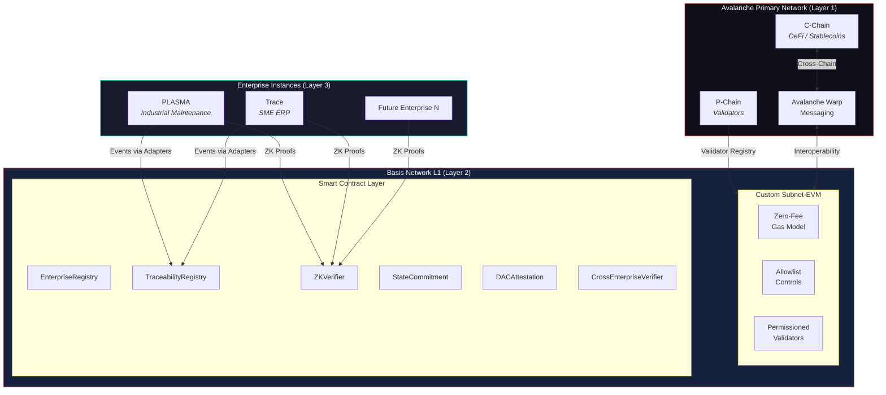
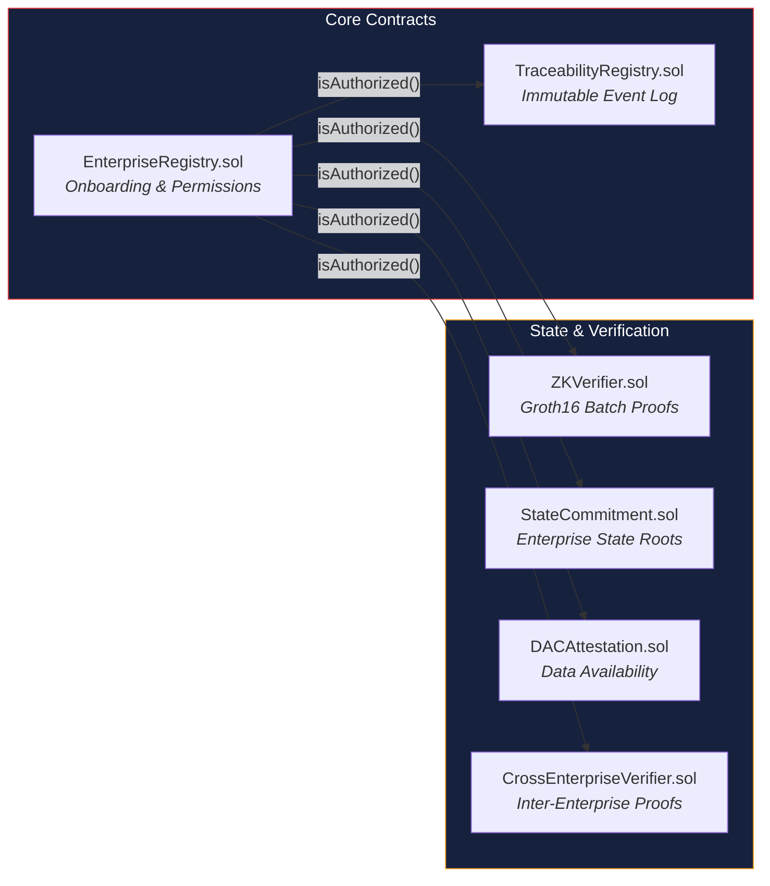
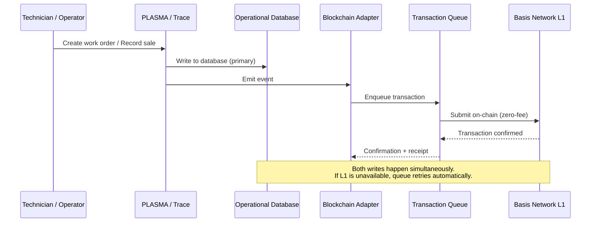
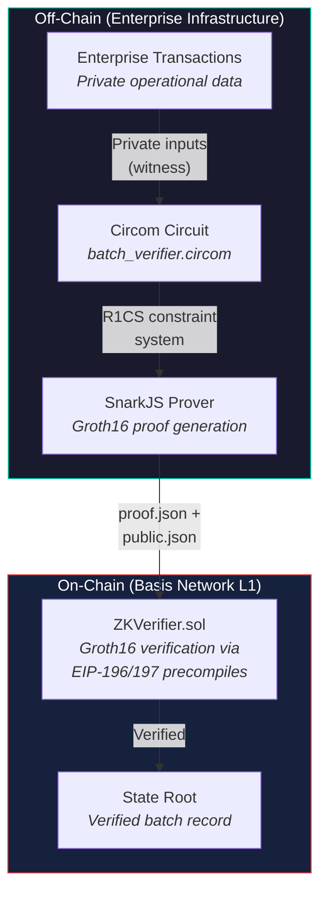
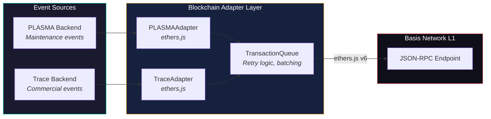
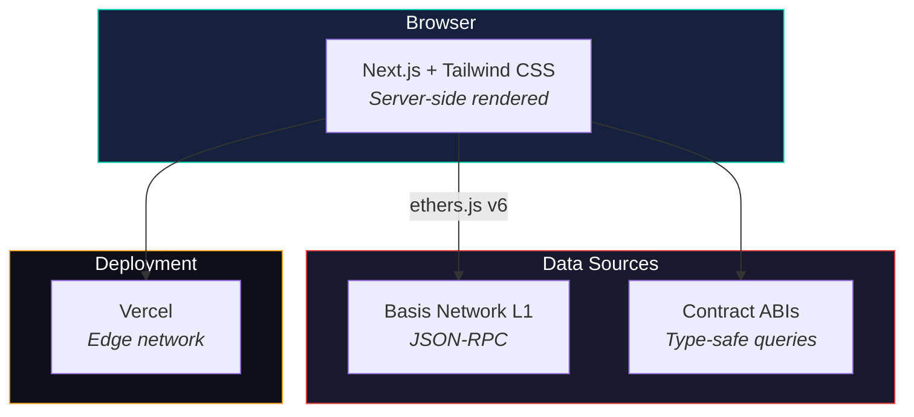
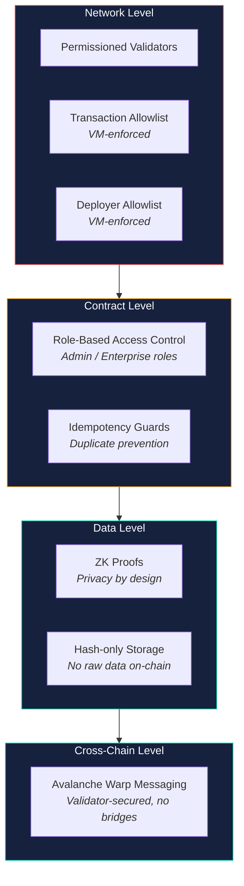
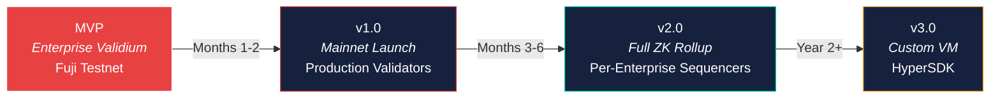

# Architecture

## System Overview

Basis Network is a three-layer architecture built on Avalanche, designed for enterprise-grade traceability with cryptographic privacy guarantees.

### Layer 1 -- Avalanche Primary Network

The global Avalanche network provides security, interoperability, and validator infrastructure. Basis Network anchors to the P-Chain for validator registration and uses Avalanche Warp Messaging (AWM) for cross-chain communication with the C-Chain.

### Layer 2 -- Basis Network L1

A customized Subnet-EVM blockchain with the native currency **Lithos** (LITHOS, smallest unit: Tomo):

- **Near-zero-fee gas model** (`minBaseFee: 1` wei, effectively free; minimum of 1 wei prevents dynamic baseFee decay to 0)
- **Transaction allowlist** -- only authorized enterprise wallets can send transactions
- **Contract deployer allowlist** -- only admin addresses can deploy smart contracts
- **Permissioned validators** -- participating enterprises validate the network

Smart contracts deployed on this layer handle enterprise registration, generic event recording, state commitment, ZK proof verification, DAC attestation, and cross-enterprise verification.

### Layer 3 -- Enterprise ZK Layer 2 (Operational)

Each enterprise gets a private execution environment implemented as a ZK validium node:

- Transactions are received via REST API and persisted to a Write-Ahead Log (WAL)
- State is maintained in a Sparse Merkle Tree (Poseidon hash, BN128 curve)
- A Batch Aggregator groups transactions by size or time threshold
- The ZK Prover generates Groth16 proofs attesting to batch validity (12.9s, 274K constraints)
- Proofs are submitted to `StateCommitment.sol` with delegated verification via `Groth16Verifier.sol` (306K gas)
- Data availability is ensured through a DAC with Shamir (2,3) Secret Sharing
- Cross-enterprise verification enables trustless inter-enterprise proofs without data disclosure

The validium pipeline is **fully operational and verified on-chain**. All 7 modules are backed by TLA+ formal specifications (10.7M states explored), Coq verification proofs (125+ theorems, 0 Admitted), and adversarial test reports (~100 attack vectors tested).

This evolves toward full zkEVM L2 with per-enterprise sequencers, EVM execution, and PLONK provers (architecture 80% complete in `zkl2/`).

---

## Smart Contract Architecture

**EnterpriseRegistry** manages enterprise onboarding and permissions. Only the network admin (Base Computing) can register or deactivate enterprises. Enterprises can update their own metadata.

**TraceabilityRegistry** is the generic event recording layer. Any authorized enterprise can record events with application-defined event types (typically `keccak256` of a type string). The L1 does not interpret or constrain event types -- this is fully application-agnostic.

**ZKVerifier** verifies Groth16 zero-knowledge proofs on-chain. It validates that a batch of enterprise transactions is correct without accessing the underlying data.

**StateCommitment** tracks per-enterprise state root history. Each enterprise maintains a verifiable chain of state roots representing their off-chain Merkle tree state.

**DACAttestation** implements Data Availability Committee attestation. Committee members sign off on data availability for enterprise batches before they are certified on-chain.

**CrossEnterpriseVerifier** verifies cross-references between enterprises. It enables provable inter-enterprise interactions without exposing private data from either party.

---

## Data Flow: Dual-Write Pattern

The integration uses a dual-write pattern that ensures zero disruption to existing production systems.

### On-Chain Data (stored on L1)

- Enterprise registration records (address, name, metadata hash, status)
- Event hashes and metadata (event type, asset ID, timestamp, enterprise)
- Application-encoded event data (interpreted by adapters, not the L1)
- ZK proof verification results (proof hash, verification status, batch size)
- State roots per enterprise (state commitment chain)
- DAC attestation records (committee signatures, certification status)
- Cross-enterprise verification records (inter-enterprise proofs)

### Off-Chain Data (stays in enterprise databases)

- Detailed text descriptions (work order details, notes)
- Photos, attachments, documents
- User interface data, session management
- Real-time sensor data (high frequency)
- Personally identifiable information (PII)

This separation ensures compliance with data privacy regulations while maintaining an immutable audit trail.

---

## ZK Validium Pipeline

The ZK validium model ensures that:

1. **Enterprise data stays private** -- transaction details never leave the enterprise's infrastructure.
2. **Validity is guaranteed** -- the Groth16 proof mathematically proves the batch is correct.
3. **Verification is efficient** -- ~200K gas per proof verification using EVM precompiles (ecAdd, ecMul, ecPairing).
4. **The interface is upgradeable** -- swapping the off-chain prover (Circom to SP1, Halo2, etc.) requires no on-chain changes.

---

## Blockchain Adapter Architecture

The adapter provides:

- **Dual-write guarantee** -- existing databases are never disrupted; on-chain writes are additive.
- **Fault tolerance** -- if the L1 is temporarily unavailable, events queue and sync on reconnection.
- **Retry logic** -- configurable retry count and exponential backoff.
- **Idempotency** -- duplicate events are rejected at the contract level (unique IDs).

---

## Dashboard Architecture

The dashboard is deployed at [dashboard.basisnetwork.com.co](https://dashboard.basisnetwork.com.co) and provides six pages:

- **Overview** -- block height, gas price, enterprise count, ZK batch stats, recent blocks
- **Enterprises** -- registered enterprises, authorization status, registration dates
- **Activity** -- real-time event feed with type badges (auto-refresh every 10s)
- **Modules** -- deployed protocol components and their status (7 contracts)
- **Validium** -- batch history, ZK circuit specifications, DAC status, state machine visualization

All pages share state via `NetworkContext` with 10-second polling. Ecosystem navigation links connect the dashboard to the landing page and block explorer.

---

## Network Configuration

| Parameter | Value | Rationale |
|---|---|---|
| `minBaseFee` | 1 wei | Near-zero-fee model; 1 wei minimum prevents baseFee decay to 0 (Subnet-EVM v0.8.0 rejects baseFee==0) |
| `gasLimit` | 15,000,000 | Standard EVM block gas limit |
| `targetBlockRate` | 2 seconds | Balance between throughput and finality |
| `txAllowList` | Enabled | Only authorized enterprises can transact |
| `contractDeployerAllowList` | Enabled | Only admins can deploy contracts |
| `allowFeeRecipients` | false | No fee distribution needed with zero-fee model |

---

## Security Model

Security is enforced at four layers:

1. **Network level:** Permissioned validators, transaction allowlist, deployer allowlist -- enforced at the VM level, not bypassable by smart contracts.
2. **Contract level:** Role-based access control with custom errors for clear revert reasons. Idempotency guards prevent duplicate records.
3. **Data level:** Sensitive data never touches the blockchain. Only hashes, metadata, and ZK proofs are stored on-chain.
4. **Cross-chain level:** AWM provides native, validator-secured communication without relying on third-party bridges that introduce trust assumptions.

---

## Evolution Roadmap

